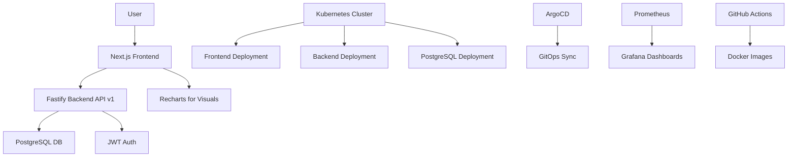

# Full-Stack Application Plan for trii

## Overview
Build a full-stack fintech educational platform with Next.js frontend, Node.js backend, PostgreSQL database, deployed on Kubernetes with GitOps using ArgoCD, including observability and CI/CD.

## Architecture
- **Frontend**: Next.js (App Router), TypeScript, Tailwind CSS, Recharts
- **Backend**: Node.js + Fastify, REST API v1, layered architecture
- **Database**: PostgreSQL with migrations and seed data
- **Auth**: JWT-based authentication
- **Feature Flags**: Environment-controlled flags
- **Deployment**: Kubernetes (kind), Kustomize, ArgoCD
- **Observability**: Prometheus metrics, Grafana dashboards
- **CI/CD**: GitHub Actions for build and image versioning

## Repository Structure
```
/frontend
/backend
/k8s
  /base
  /overlays/local
/argocd
/.github/workflows
```

## Key Components
1. **Frontend**:
   - Landing page with educational content
   - Investment recommendations with charts
   - Auth-protected routes
   - API consumption (/api/v1)

2. **Backend**:
   - API endpoints: /api/v1/investments, /recommendations, /auth
   - Rule-based recommendation logic
   - JWT auth middleware

3. **Database**:
   - Tables: users, investments, recommendations
   - Migrations and dummy seed data

4. **Kubernetes**:
   - Deployments for frontend, backend, PostgreSQL
   - Services, ConfigMaps, Secrets
   - Health checks

5. **GitOps**:
   - ArgoCD Application for auto-sync

6. **Observability**:
   - Prometheus /metrics endpoint
   - ServiceMonitor
   - Basic Grafana dashboard JSON

7. **CI/CD**:
   - GitHub Actions workflow for build, test, Docker image creation

## Design Specifications
- **UI/UX**: Minimalist fintech style, pastel colors (#A9A0EC, #C7E0FF), Albert Sans typography
- **Content**: Educational, beginner-friendly, Colombian Spanish

## Development Phases
1. Set up project structure and dependencies
2. Implement backend API and database
3. Develop frontend components and pages
4. Configure Kubernetes manifests with Kustomize
5. Set up ArgoCD application
6. Add observability components
7. Create CI/CD pipeline
8. Test local deployment with kind

## Mermaid Diagram: System Architecture


This updated plan covers the full-stack requirements. Are you pleased with this plan, or would you like to make any changes?